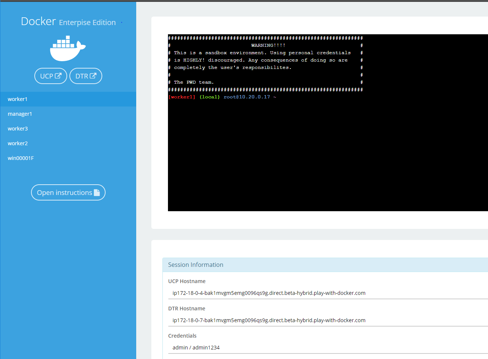

# 2018 Docker Global Event Series: Hands-On Labs

## Understanding the Play With Docker Interface

This workshop is only available to people doing a Hands-on Lab at one of Docker's in-person events. The environment will be based on [Play with Docker](https://labs.play-with-docker.com/).

If that doesn't apply to you, you may be interested in the labs available through the [Play with Docker Classroom](training.play-with-docker.com) or the [Play with Kubernetes Classroom](https://training.play-with-kubernetes.com/).

There are three main components to the Play With Docker (PWD) interface. 

### 1. Console Access
Play with Docker provides access to the 4 Docker EE hosts in your Cluster. These machines are:

* A Linux-based Docker EE 18.01 Manager node
* Three Linux-based Docker EE 18.01 Worker nodes
* A Windows Server 2016-based Docker EE 17.06 Worker Node (if doing a windows oriented lab)

By clicking a name on the left, the console window will be connected to that node.

### 2. Access to your Universal Control Plane (UCP) and Docker Trusted Registry (DTR) servers

Additionally, the PWD screen provides you with a one-click access to the Universal Control Plane (UCP)
web-based management interface as well as the Docker Trusted Registry (DTR) web-based management interface. Clicking on either the `UCP` or `DTR` button will bring up the respective server web interface in a new tab.

### 3. Session Information

Throughout the lab you will be asked to provide either hostnames or login credentials that are unique to your environment. These are displayed for you at the bottom of the screen.

## Document conventions

- When you encounter a phrase in between `<` and `>`  you are meant to substitute in a different value.

	For instance if you see `<dtr hostname>` you would actually type something like `ip172-18-0-7-b70lttfic4qg008cvm90.direct.ee-workshop.play-with-docker.com`

- When you see the Linux penguin all the following instructions should be completed in your Linux console

	

- When you see the Windows flag all the subsequent instructions should be completed in your Windows console. You can skip these sections if you have a Linux only environment.

    

[Docker for Beginners - Linux](/beginner-linux/)
You've been learning about Docker, here's a chance to get a hands on introduction to the key concepts of Docker. This lab will cover the basics of 
* Images
* Running containers
* Container isolation

[Docker for Beginners - Windows](/beginner-win/)
You've been learning about Docker, here's a chance to get a hands on introduction to the key concepts of Docker. This lab will cover the basics of 
* Images
* Running containers
* Container isolation
* Orchestration

[Docker EE - an Introduction](/ee-intro/)
Docker Enterprise Edition (EE) is a Containers-as-a-Service platform that manages and secures diverse applications across disparate infrastructure, both on-premises and in the cloud. This workshop will introduce you to the basics of creating and deploying an app on Docker EE. 

[Docker Security](/security/)
The Docker Platform has built in a number of features that make it the most secure way to deploy containerized applications across disparate infrastructure. This lab will explore features such as Security Scanning, Role Based Access Control, Security Policies, and Docker Content Trust.

[Modernizing Traditional Java Applications](/mta-java/)
Moving an application to Docker doesn't mean you have to re-write your whole application. In this lab, you'll containerize an older, monolithic Java application without changing any code. And you'll see the benefit of running it on Docker. Then in a few simple steps you'll build additional services in separate containers, breaking features out of the monolith into separate containers, without rewriting the app. 

[Modernizing Traditional .NET Applications](/mta-dotnet/)
Moving an application to Docker doesn't mean you have to re-write your whole application. In this lab, you'll containerize an older, monolithic .NET application without changing any code. And you'll see the benefit of running it on Docker. Then in a few simple steps you'll build additional services in separate containers, breaking features out of the monolith into separate containers, without rewriting the app. 

[Docker EE with Kubernetes](https://github.com/dockersamples/ee-workshop)
Docker EE 2.0 is the first Containers-as-a-Service platform to offer production-level support for the integrated management and security of both Linux and Windows Server Containers. It is also the first platform to support both Docker Swarm and Kubernetes orchestration.

In this lab we'll use a Docker EE cluster comprised of Windows and Linux nodes. We'll deploy both a Java web app on Linux and a multi-service application that includes both Windows and Linux components using Docker Swarm. Then we'll take a look at securing and scaling the application. Finally, we will then deploy the app using Kubernetes.
